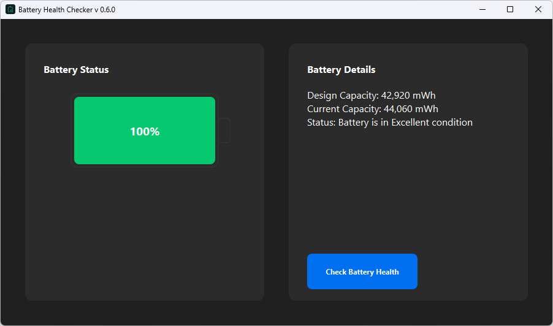

# Battery Health Checker

A Windows application that helps you monitor and optimize your laptop's battery health with a single click.

## Features

-   🔋 **Easy Battery Status Check**: Check your battery's health status with one click
-   📊 **Detailed Analytics**: Get comprehensive reports about your battery's performance and health
-   💻 **Windows Compatible**: Designed specifically for Windows laptops
-   🎯 **User-Friendly Interface**: Simple and intuitive design for all users

## Download

Download the latest version of Battery Health Checker:

[Download Battery Health Checker v0.5b](./Battery-Health-Checker%20V%200.5b.zip)

**SHA-256:** `6065c12e8cfccdc1812e27e5d136ffd78a5b72c2a0591568676986d9bdffa9a0`

## System Requirements

-   Windows 10 or later
-   .NET Framework 4.7.2 or higher
-   Administrator privileges (required for accessing battery information)

## Installation

1. Download the ZIP file
2. Extract the contents to your preferred location
3. Run `BatteryHealthChecker.exe`
4. Grant administrator privileges when prompted

## Usage

1. Launch the application
2. Click the "Check Battery Health" button
3. View your battery's health status and detailed report

## Contributing

Contributions are welcome! Please feel free to submit a Pull Request.

## License

This project is licensed under the MIT License - see the [LICENSE](LICENSE) file for details.

## Support

If you encounter any issues or have questions, please [open an issue](../../issues) on GitHub.

## Acknowledgments

-   Thanks to all contributors who have helped with the development
-   Special thanks to the Windows battery management API documentation

## Security

All releases are signed and include SHA-256 hashes for verification. Always verify the hash before running the application.

## Version History

-   **v0.5b** (Current)
    -   Initial beta release
    -   Basic battery health checking functionality
    -   Detailed analytics implementation

---

<!-- Made with ❤️ by [Your Name/Organization] -->
